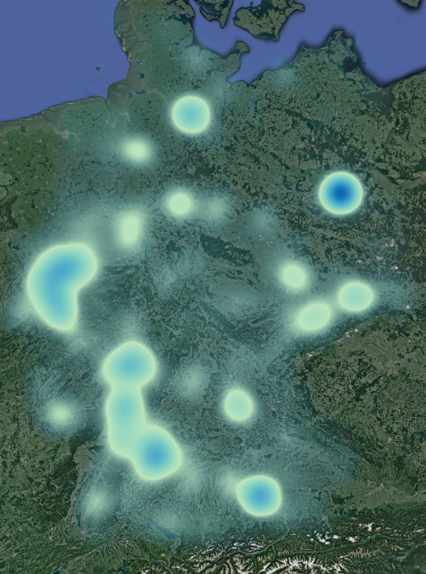
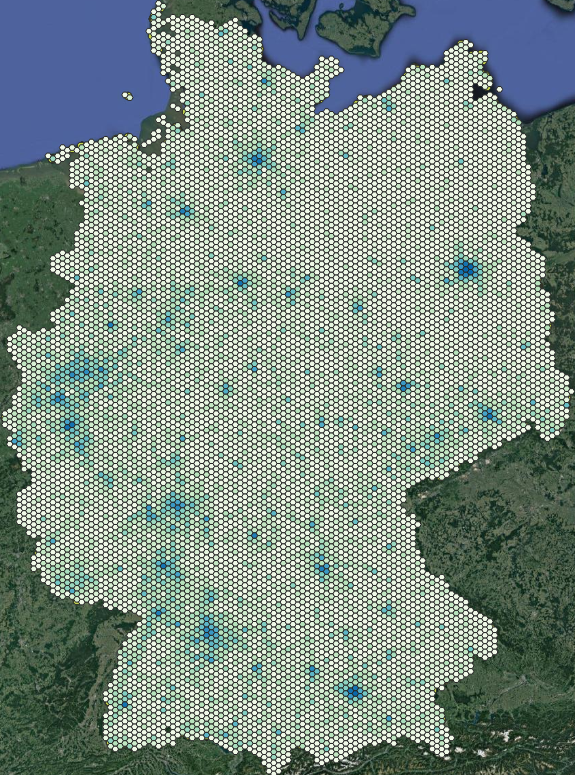

# Bestagon QGIS Plugin

## Introduction
The Bestagon plugin allows fast visualization for point intensities 
represented by different forms as rectangles or hexagons. More forms 
are coming soon...

:construction: It is recommended to use the same version as the plugin is developed with: **QGIS 3.34.0** :construction:

## Installation
Download the [zip file](https://github.com/KonstiDE/Bestagon/archive/refs/heads/master.zip) of the master branch of the current repository and install it manually via the plugin installation
manager of QGIS. Bestagon requires a minimum QGIS version of ``3.0``. You might __restart__ QGIS once after the installation. Alternatively, search for `Bestagon` in the QGIS plugin installation manager and hit install.

## Exemplary Usage
To work, Bestagon requires a point layer to display any intensity information. Anyhow,
the independence of the source of the file, we demonstrate the usage on a point layer file
by [QuickOSM](https://plugins.qgis.org/plugins/QuickOSM/) from OpenStreetMap. Furthermore,
shapefiles used in the following analysis can be downloaded at 
[GADM](https://gadm.org/download_country.html) country-wise.

### Research Question
In the following, we investigate onto the bakery-density across europe. Since Germany is 
called the land with the most sorts of bread, we would expect the highest density of individual
bakeries here. Bestagon easily gives a visual overview whether this is true through the
following steps:

1. Download the data\
We here utilize a point layer of QuickOSM of all backeries in europe and the world GADM administrative 
boundaries shapefile, cut to europe. (also described in Section [Exemplary Usage](#exemplary-usage)).

2. Bestagon settings\
Call the installed Bestagon QGIS plugin by the icon in the toolbar or
via ``Plugins > Bestagon > Bestagon`` and set up the following settings:
    * Mandatory params:
      * __Point layer:__ ``export.gpkg`` (Bakery point layer from QuickOSM)
      * __Form width:__ ``100 (km)``
      * __Form height:__ ``100 (km)``

    * Optional shape params:
      * __Shape layer:__ ``europe_clip.gpkg`` (Clipped administrative border layer from GADM)
      * [x] Mask layer
      * [ ] Keep form (not recommended for large extends)

    * Optional style params:
      * __Color ramp:__ ``GnBu`` (customizable also later on)
      * __Number of classes:__ ``35``

\
\
The configuration should then look like denoted:

Hit run and enjoy :stuck_out_tongue:. The output will look like depicted in the following picture:

As shown, the bakery density is indeed clustered in the land of the bread, Germany.
Through the fast and easy visualization we can directly conclude that the bread variety decreases, the more 
north-east we go, as fewer bakeries are available. We show of further potential of Bestagon with the bakery density
in Germany by playing around with the settings it provides:

|             Rectangle              |             Diamond              |             Hexagon              |             Triangle              |          Fishernet (beta)          |           Bubbles            |
|:----------------------------------:|:--------------------------------:|:--------------------------------:|:---------------------------------:|:----------------------------------:|:--------------------------------------:|
|  |  |  |  |  |  |

Through the soft cut option (``Keep form``), we preserve forms at the border and remove (not) forms not intersecting with
the shape file provided. We depict a soft-cut version in the following figure:

